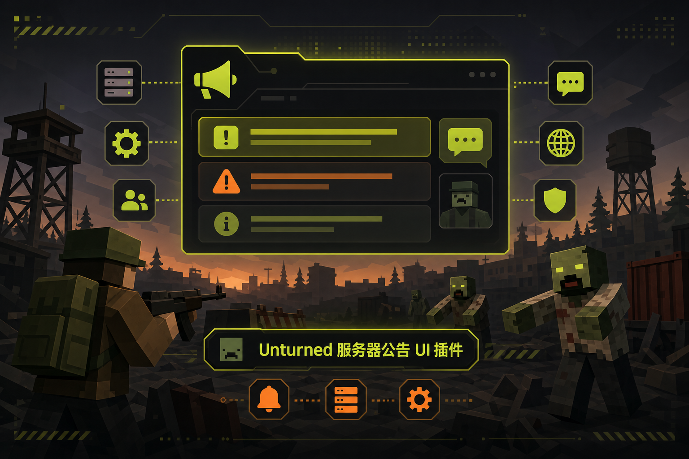
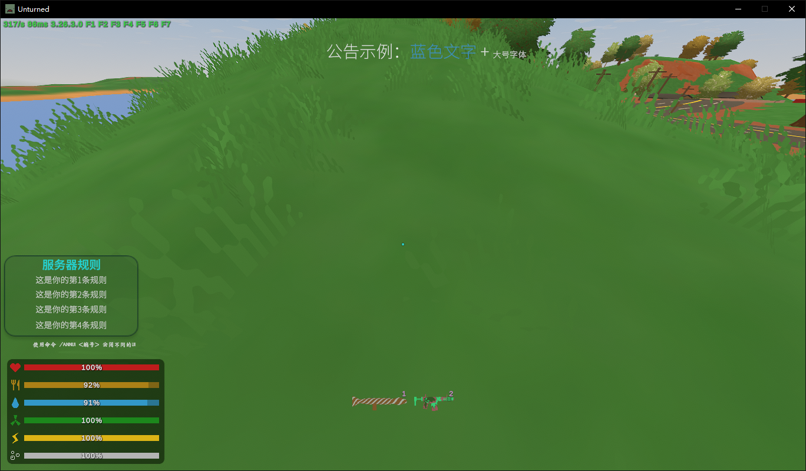
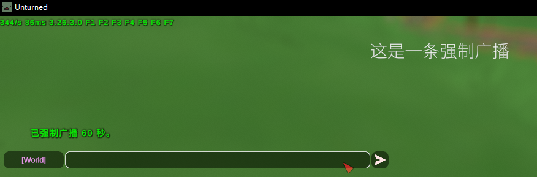
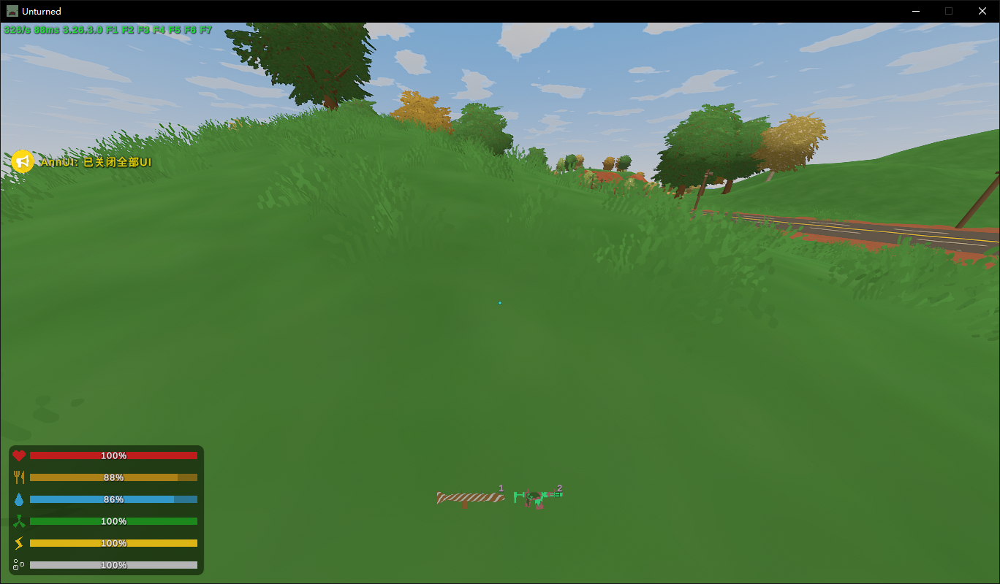
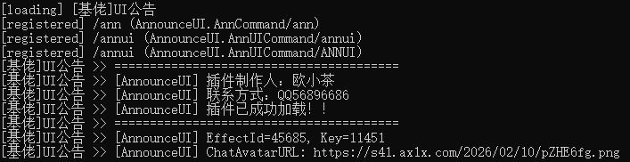
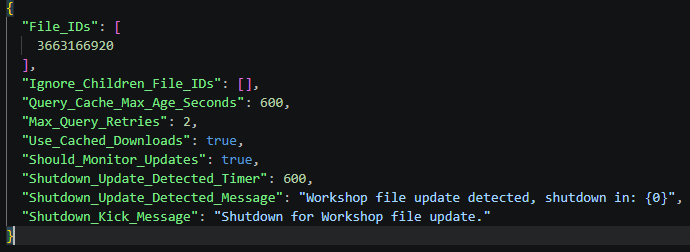

# Unturned Announcement UI Plugin

<p align="center">
  
</p>

<p align="center">
  <a href="LICENSE"></a>
  
  
  
</p>

> 一个面向 Unturned 服务器的公告 UI 插件。玩家进服后加载自定义 UI，用于展示服务器规则、轮播公告、临时强制公告，并同步发送聊天公告。

## 概览

`Unturned Announcement UI Plugin` 用于统一展示服务器规则、活动通知、维护提醒和临时广播。插件内置默认 UI，也支持使用 Unity 修改界面后重新上传到 Steam 创意工坊。

| 能力 | 说明 |
| --- | --- |
| UI 公告面板 | 玩家进服后自动加载公告 UI，可通过命令控制显示状态 |
| 服务器规则展示 | 从配置文件读取规则文本，并显示在独立规则面板中 |
| 公告轮播 | 按配置间隔循环展示多条公告 |
| 临时强制公告 | 管理员可用命令临时覆盖轮播内容 |
| 聊天同步 | 可选择把 UI 公告同步发送到游戏聊天 |
| 富文本格式 | 支持颜色、字号、加粗、斜体、换行和变量替换 |
| 自定义 UI | 基于 Unity 工程调整图片、字体、布局和样式 |

## 截图展示

### 游戏内 UI

| 规则面板与公告轮播 | 强制公告 |
| --- | --- |
|  |  |

### UI 开关与加载状态

| 关闭全部 UI | 插件加载成功 |
| --- | --- |
|  |  |

## 下载与安装

1. 打开 GitHub Releases，下载 `Unturned-Announcement-UI-Plugin-v1.0.0.zip`。
2. 解压后取得插件文件：`[基佬]UI公告.dll`。
3. 将 DLL 放入 Rocket 插件目录：

```text
Servers/<服务器名>/Rocket/Plugins/
```

4. 重启服务器，插件会自动加载并生成配置文件。
5. 确保服务器已加载对应的 UI Effect 资源。

启动成功后，控制台输出插件信息、命令注册信息和当前 `EffectId`：

<p align="center">
  
</p>

## 默认 UI 与创意工坊

默认创意工坊资源：

[Steam 创意工坊：公告 UI](https://steamcommunity.com/sharedfiles/filedetails/?id=3663166920)

默认配置中的 `EffectId` 为 `45685`。使用默认 UI 时保持该值。

服务器无法自动下载创意工坊内容时，在 `WorkshopDownloadConfig.json` 中加入默认 UI 的文件 ID：

```json
{
  "File_IDs": [
    3663166920
  ]
}
```

<p align="center">
  
</p>

创意工坊链接失效时，下载 Release 附件中的 `Effect.unity3d`，再按下方自定义 UI 流程导入和上传。

## 命令与权限

| 命令 | 权限 | 说明 |
| --- | --- | --- |
| `/annui` | 无 | 开启或关闭全部 UI |
| `/annui 01` | 无 | 开启或关闭服务器规则 UI |
| `/annui 02` | 无 | 开启或关闭服务器公告 UI |
| `/ann <文字> <秒数>` | `ann` | 强制广播一条临时公告 |

示例：

```text
/ann {color=#38bdf8}{b}服务器将在 5 分钟后维护{/b}{/color} 60
```

## 配置说明

插件首次启动后会生成配置文件。配置项控制公告内容、轮播间隔、聊天同步和 UI 默认显示状态。

| 配置项 | 说明 |
| --- | --- |
| `EffectId` | UI Effect ID，默认 `45685` |
| `ShowUIByDefault` | 玩家进服后是否默认显示 UI |
| `EnableUIAnnouncements` | 是否启用 UI 公告 |
| `EnableChatAnnouncements` | 是否同步发送聊天公告 |
| `ChatMessageColor` | 聊天公告颜色 |
| `ChatAvatarURL` | 聊天公告头像 URL，留空则不显示头像 |
| `AnnouncementIntervalSeconds` | 公告轮播间隔，单位秒 |
| `EnableRulesUI` | 是否启用服务器规则 UI |
| `ServerTitleText` | 规则 UI 标题 |
| `RulesFieldCount` | 规则文本字段数量 |
| `Rules` | 服务器规则列表 |
| `HelpText` | UI 底部提示文本 |
| `Announcements` | 公告轮播列表 |

## 富文本与变量

配置文件中使用 `{}` 书写富文本。插件会自动转换为 Unity / TextMesh Pro 可识别的 `<>` 格式，避免 XML 风格标签被配置文件误处理。

### 富文本写法

| 写法 | 效果 |
| --- | --- |
| `{b}文字{/b}` | 加粗 |
| `{i}文字{/i}` | 斜体 |
| `{color=#38bdf8}文字{/color}` | 设置颜色 |
| `{size=20}文字{/size}` | 设置字号 |
| `{br}` | 换行 |

### 可用变量

| 变量 | 说明 |
| --- | --- |
| `{player_name}` | 玩家名称 |
| `{player_id}` | 玩家 Steam ID |
| `{server_name}` | 服务器名称 |
| `{server_players}` | 当前在线人数 |
| `{server_maxplayers}` | 最大人数 |
| `{server_map}` | 地图名 |
| `{server_mode}` | 游戏模式 |

## 自定义 UI

仓库内包含 Unity 工程，用于调整默认 UI。使用 Unity `2022.3.62f3` 打开 `UI/Unturned`。

自定义流程：

1. 从 GitHub Release 下载 `Effect.unity3d`，或使用仓库中的 Unity 工程。
2. 调整 UI 图片、字体、布局和样式。
3. 不要重命名层级结构中的关键对象，插件会通过对象名称查找 UI 元素。
4. 重新上传到 Steam 创意工坊，并使用唯一的 GUID 和 ID。
5. 将新 UI 的 Effect ID 写入配置文件中的 `EffectId`。
6. 重启服务器并验证 UI 是否正常显示。

关键对象名：

```text
Canvas
ServerRulesUI
AnnouncementUI
ServerText
ServerRulesText
ServerRulesText1
ServerRulesText2
ServerRulesText3
HelpText
AnnouncementText
```

## 开发构建

本项目使用 `.NET Framework 4.8`，依赖 `RestoreMonarchy.RocketRedist`。

```powershell
dotnet restore
dotnet build "服务器公告带UI.sln" -c Release
```

Release DLL 输出位置：

```text
bin/Release/net48/[基佬]UI公告.dll
```

## License

本项目基于 [MIT License](LICENSE) 开源发布。MIT 是标准开源协议，允许使用、复制、修改、分发和再许可；使用者需要保留原始版权与许可声明。
